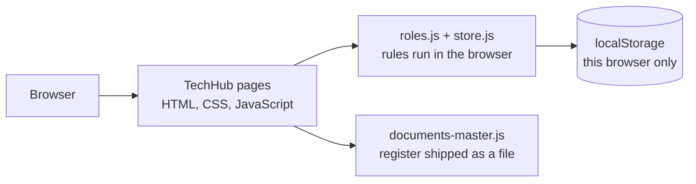
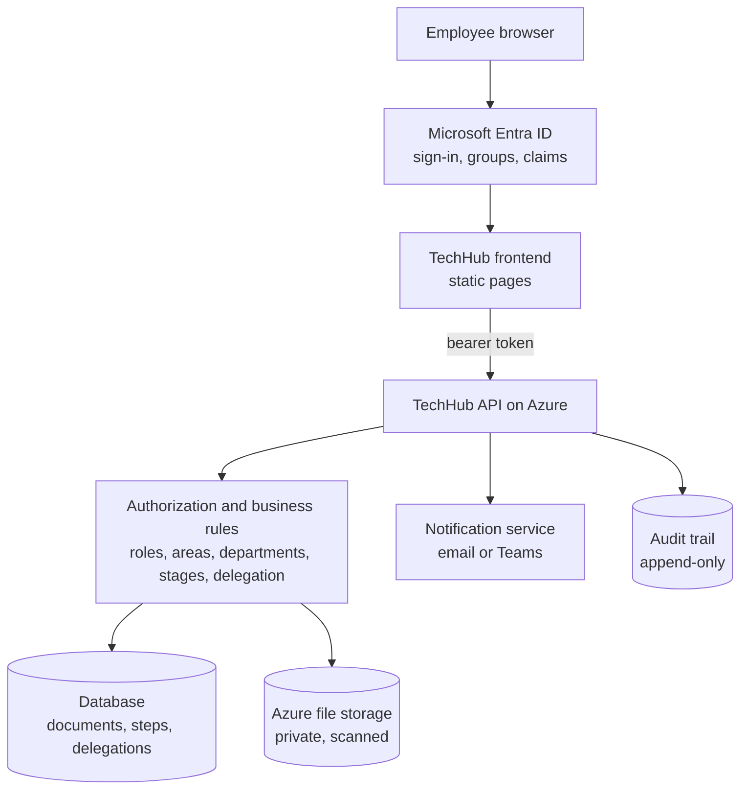

# Azure integration requirements

What the IT team must build or decide to turn the TechHub prototype into a system real employees use. Rules: `BUSINESS-RULES.md`. Endpoints: `API-REQUIREMENTS.md`. Entities: `DATA-MODEL.md`. Findings below were measured on 1 October 2026 (`docs/QA/FIVE-ROLE-QA-AUDIT.md`, and the handover audit in `HANDOVER-TO-IT.md` §8).

---

## 1. Architecture

**Current prototype**

Everything runs in one browser. A role is chosen from a switcher, records exist only on that computer, and anyone with the developer console can change them.

**Target**

The frontend stays a set of static pages. Everything that decides who may do what, every record, every file and every notification moves behind the API.

## 2. Configuration strategy

Values that differ between **LOCAL / DEV / TEST(UAT) / PRODUCTION**, where they are today, and what to do:

| Value | Where it is today | Recommendation |
|---|---|---|
| API base URL | none (no API) | `TECHHUB_CONFIG.apiBaseUrl` |
| Entra tenant ID, SPA client ID, authority, redirect / logout URLs, API scopes | none | `TECHHUB_CONFIG.entra` (identifiers, not secrets) or the hosting platform's built-in auth |
| Application public URL (QR codes, shared links) | derived from `location` at runtime | keep runtime derivation; `appBaseUrl` only if a canonical host is required |
| SCORE library link | `documents-master.js`, `TAQA_DOC.scoreUrl` (`https://score.taqa.com.sa/library/`) | `TECHHUB_CONFIG.links.scoreLibraryBase` |
| Viva Engage community link | `index.html` hero link | `TECHHUB_CONFIG.links.vivaEngageCommunity` |
| Content-Security-Policy | a `<meta>` tag repeated in 13 pages: `connect-src 'self'` | **Must change** for any API on another origin and for Entra sign-in (`login.microsoftonline.com`). Recommended: move the policy to a response header in the hosting config, one place per environment. `tests/security-regression.spec.js` pins today's meta policy and must be updated with it |
| Security headers | `staticwebapp.config.json` `globalHeaders` | keep; add CSP here (see above) |
| Service worker cache name | `service-worker.js` `const CACHE = 'taqa-hub-vNN'` | bump on every release, or stamp it in CI (§10) |
| Feature flags: role switcher, local register, demo fixtures | always on | `TECHHUB_CONFIG.features.*`, all **false** in UAT and production (§9) |
| Logging level / client error endpoint | errors kept in `localStorage` `taqa-errors` | `TECHHUB_CONFIG.logging` |
| Static Web Apps deployment token | GitHub secret `AZURE_STATIC_WEB_APPS_API_TOKEN_…` (referenced, not committed) | IT's own Static Web App and secret; the current one belongs to the prototype |

**Template:** `config/techhub.config.example.js` shows the shape with placeholders only. Copy it to `config/techhub.config.js` per environment (git-ignored) and load it before `shared.js`. **Nothing in a browser config is secret**: never put a client secret, storage key, connection string or SAS token there; they belong to the API (Key Vault / managed identity). No page loads the template today, so the prototype behaves exactly as before.

## 3. Microsoft Entra ID

The final system must derive identity and permissions from **trusted server-side identity** (token claims and group/app-role mappings resolved by the API), **never** from the browser role switcher (`localStorage taqa-demo-role` / `taqa-demo-area`).

| TechHub persona | Entra mapping (IT decides names) | Extra attribute needed |
|---|---|---|
| Employee | every signed-in TAQA user, or `<GROUP_TECHHUB_USERS>` | — |
| QMS / Document Controller | `<GROUP_OR_APP_ROLE_QMS>` | — |
| Segment Director (Function Head, Centre Manager, Corporate Sponsor) | `<GROUP_OR_APP_ROLE_AREA_HOLDER>` | **which area(s)**: one group per area (`<GROUP_HOLDER_{AREA}>`) or an attribute |
| Maintenance Manager | `<GROUP_OR_APP_ROLE_MAINTENANCE_MANAGER>` | **which operational segment(s)**; must be an operational segment |
| External Auditor | `<GROUP_OR_APP_ROLE_AUDITOR>`, time-boxed per audit (for example access reviews / guest expiry) | audit window |
| Glossary reviewer: technical SME / discipline owner (not one of the five document personas) | `<GROUP_GLOSSARY_SME_{CATEGORY}>` or an attribute | **which glossary categories**; mapping defined by the business / IT implementation (`BUSINESS-RULES.md` §13) |
| Glossary administration | `<GROUP_OR_APP_ROLE_GLOSSARY_ADMIN>` (expected: QMS) | administrative only; not technical approval |

After sign-in the frontend needs (`GET /me`): `userId`, `displayName`, `roles[]`, `areas[]` for scoped roles, `memberships[]` and the server-computed `visibleAreas[]`, department where relevant, active delegations the user may act under, and the capability flags. If a user holds more than one role, IT and the owner must decide whether TechHub asks which hat they are wearing or merges capabilities; the prototype assumes one role at a time.

**Segment membership is separate from role** (`BUSINESS-RULES.md` §14). Roles above come from Entra groups / app roles; membership says which operational segment **and department** (Operations or Maintenance) an employee belongs to; it decides what they see (their segment, every Corporate Function, every Center of Excellence, Company Wide) and who administers them, and **never** grants approval authority. For Azure:
- **Investigate first** whether membership (segment and department) can be derived automatically from an authoritative source: Entra organisational attributes (department, company, office, extension attributes), the HR system, business unit, organisational unit, cost centre or another authoritative attribute. **Do not assume one exists**; verify it with HR / Entra owners. If one does, assign membership automatically and keep Add Member for exceptions and corrections.
- **Add Member** (production name for the prototype's "Add Contributor") is contextual ("Add Operations Member" / "Add Maintenance Member"); the server sets segment and department from the manager's authorised context. It takes only a corporate email, resolves the person in Entra ID / the directory (immutable object id, display name, email, job title, account status), shows them for confirmation, and stores the object id. No name / title / initials typing and no Editor / Viewer / Owner choice. Directory lookup needs a least-privilege Microsoft Graph permission chosen by IT.
- Hidden from Employee and Auditor. Segment Director: view own segment, add/remove **Operations** members only. Maintenance Manager: view own segment, add/remove **Maintenance** members only. QMS / authorised administration: all segments and departments (`BUSINESS-RULES.md` §14.5).
- **Visibility and filing** (`BUSINESS-RULES.md` §14.2–14.3): an Employee sees and files into their member segment(s) plus Corporate Functions, Centers of Excellence and Company Wide (no operational segment without a membership); a Segment Director or Maintenance Manager sees their held segment plus the same shared areas, and other segments only through an explicit membership; QMS and the Auditor see every area. The API computes visible and fileable areas from stored membership and role on every request; nothing the browser sends can widen it.
- **One primary segment**; additional memberships only as approved exceptions with a reason and optional expiry, managed by the receiving department authority or QMS, ended automatically at expiry (§14.8). **One department per segment**; a department or segment change is an audited **transfer** performed by QMS / authorised administration (managers may request or confirm), both managers notified, old record kept and linked (§14.9).
- **Delegation outside the grantor's segment** (§14.10): no membership is created; the delegate gets only the delegated queue, its documents and the allowed actions, only while the delegation is valid, computed server-side; expiry or revocation ends it at once.

Delegation must reference real users: the delegate signs in as themselves and the API applies the delegation to them. The prototype's "Act as this" button is a stand-in and must not ship.

## 4. Frontend / backend boundary

**A** UI behaviour only · **B** business rule Azure must enforce · **C** data Azure must persist · **D** security rule that must never rely on the browser.

| Rule or data | Prototype location | Class |
|---|---|---|
| Who the user is; role; area | `roles.js` `TAQA_ROLE.current/area`, `localStorage` | **D** |
| Which operational segments a user sees (segment membership) | **Not in the prototype**: every Employee sees every area; "Add Contributor" (`dashboard.html`) only draws a typed name for the session | **B + C + D** (`BUSINESS-RULES.md` §14; API filters every read by stored membership) |
| Role capabilities (submit, countersign, approve, delegate, manage, register view, export) | `roles.js` `TAQA_ROLES` | **D** (+B) |
| Can this user see this document (status, classification, drafts) | `TAQA_ROLE.canSee` | **D** (filter server-side, return 404) |
| QMS check only at stage `qms` | `TAQA_APPROVAL.canCountersign`, `store.countersign` | **B + D** |
| Final approval: stage, own area, department split, delegation types | `TAQA_APPROVAL.canApprove`, `store.approve` | **B + D** |
| Reject: stage actor, reason required | `store.reject` | **B + D** |
| Withdraw / edit: area + department; QMS global | `TAQA_ROLE.canManage(doc)`, `store.setStatus/patch/remove` | **B + D** |
| Lifecycle-field protection | `store.patch` (`LIFECYCLE` list) | **D** |
| Maintenance classification (department or bulletin) | `TAQA_APPROVAL.isMaintenance` | **B** |
| Bulletins only for operational segments | `upload.html`, `store.add` | **B** |
| Maintenance Manager holds operational segments only | `TAQA_ROLE.holds` | **B** (identity mapping) |
| Delegation: expiry ≤ 90 days, no escalation, no re-delegation, department, scope | `TAQA_DELEGATION`, `TAQA_ROLE.effective` | **B + D** |
| Signer names and timestamps | `store.actingName`, `new Date()` in the browser | **D** (from token and server clock) |
| Document numbers | `upload.html` `taqaRefId` (next number in this browser) | **B + C** (server allocates, unique) |
| Document register, drafts, overlays | `documents-master.js`, `localStorage` | **C** |
| Approval steps / audit trail | reconstructed from record fields in `viewer.html`, `analytics.html` | **C** (append-only) |
| Delegations | `localStorage` | **C** |
| Attachments | not stored | **C + D** (§6) |
| Notifications | derived in the browser (`shared.js` bell) | **C** + service (§7) |
| Concurrency (stale tab) | `store.js` re-reads before writing | **B** (ETag / version, `DATA-MODEL.md` §3) |
| Desk queues, counters, "Not your area" messages, hidden buttons, refusal pages | pages | **A** (convenience; the API must refuse regardless) |
| Upload file type / size checks | `upload.html` | **A** in the browser, **D** at the API |
| Glossary contributions: propose → pending → SME approve/reject → shared; admin recategorise/withdraw | `glossary.html` adds a "Community" term immediately, this browser only (**not** the target) | **B + C + D** (`BUSINESS-RULES.md` §13) |
| Bookmarks, theme, pins, drafts, tour | `localStorage` | **A** |

Nothing in `roles.js` or `store.js` is a security control. `roles.js` says so in its first lines; the cybersecurity review pack says so too.

## 5. Concurrency
Required: optimistic concurrency on every document transition and delegation change. Two users load the same draft; both press Approve or Reject; **only the first valid transition succeeds** and the second gets **409 Conflict** with the current state. ETag / row version / version number are all acceptable. Details: `DATA-MODEL.md` §3. UAT check: `AZURE-UAT-CHECKLIST.md` N7.

## 6. Files and attachments
The prototype records a file's name, size and a browser fingerprint; **the file itself is not stored or downloadable** ("Preview not connected"). Requirements:
- Authenticated upload; the API decides whether the actor may submit to that area/department.
- Allowed types: `pdf, doc, docx, xls, xlsx, ppt, pptx, zip` (prototype list); reject empty files, disguised executables (`report.pdf.exe`) and files over 500 MB (prototype limit; confirm against TAQA policy and platform limits).
- Malware scanning before a file can be linked to a submission, if TAQA policy requires it (Defender for Storage or equivalent).
- Private storage (no public containers); downloads through the API or short-lived per-user SAS issued after an authorization check.
- Download refused for withdrawn and unapproved documents.
- Version association: file ↔ document revision; **approved content can never be replaced**; a change is a new revision with a new file.
- Metadata: name, type, size, SHA-256, uploader, time, scan result. Every upload and controlled download is an audit event.

## 7. Notifications
Today the bell is computed in the browser from the register; nothing is emailed or posted. Required: on submit → QMS; on QMS confirm → the area's Segment Director, or for a maintenance document the segment's Maintenance Manager (and any active delegate); on approve or reject → the submitter. Failed delivery must be retried or logged, never roll back the workflow step. Channel (email, Teams) is IT's choice. Field Glossary (`BUSINESS-RULES.md` §13): a new proposal → the category's SME; approval or rejection → the submitter.

## 8. Hosting and routing
- **Measured:** every important page opened by direct URL and refreshed, at 1440 and 390 px: Home, segment (Operations and Maintenance side), Upload, approval desk (QMS, Director, Maintenance Manager), document page, Master List (QMS, Auditor), Search, Glossary, Ask Expert, Form, Analytics, About, offline page. **38 of 38 loaded, no 4xx asset requests, no script errors.**
- Multi-page static site: every page is a real `.html` file and state lives in the query string (`?id=`, `?doc=`, `?dept=`). No client-side router, **no rewrite rules needed**.
- All asset paths are **relative** (no leading `/`), so the app works under a sub-path. `manifest.json` uses `./`. The service worker derives its base path at runtime.
- Filenames are lower-case and every reference matches its file exactly (checked), so case-sensitive hosts are safe.
- `staticwebapp.config.json`: security headers; `no-cache` on `service-worker.js`; immutable caching for fonts and icons; **non-app paths blocked** (`/docs/*`, `/tests/*`, `/.github/*`, README, package files, Playwright config: added in this audit because the deploy publishes the whole repository).
- *Recommended:* the `navigationFallback` sends **any unknown URL to `offline.html`**, so a mistyped address says "You're offline". Add a proper 404 page (`responseOverrides`) when IT sets up hosting.
- *Recommended:* deploy only the application files (a packaging step), rather than the repository root. Until then, the route blocks above protect Static Web Apps; **GitHub Pages (`pages.yml`) publishes everything**, so retire it or restrict it.
- Platform authentication: if the hosting platform's built-in auth is used, add `"allowedRoles": ["authenticated"]` on `/*` (see the August plan, `AZURE-MIGRATION-RAFA.md`).

## 9. Prototype-only behaviour (label, then remove or switch off for production)

| Behaviour | Where | Production |
|---|---|---|
| Role switcher ("View as …", "Preview only. Azure uses Entra ID.") | `shared.js` door, phone menu; refusal pages' "View this page as" buttons | Remove; identity from Entra |
| `localStorage` trusted as the register | `store.js`, `roles.js` | Replace with API calls |
| Records exist only on this computer | everywhere | Server persistence |
| The developer console can call `TAQA_STORE` / `TAQA_ROLE` and bypass every rule | global objects | The API enforces; the globals become thin clients |
| "Act as this" delegation button | `dashboard.html` | Delegate signs in as themselves |
| Signers recorded as role labels ("Segment Director") | `store.js` | User references from the token |
| Demo people and activity (owner and contributor names, sample activity) | `dashboard.html` `DASH_DATA`, `segments-data.js` | Real data from the directory or remove |
| Register shipped as a 259 KB script | `documents-master.js` | API; keep only as seed data for migration |
| Ask Expert shows a reference number but sends nothing ("once this connects to a ticketing system") | `support-ticket.html` | Connect or relabel |
| "Add term" publishes a glossary term at once as "Community", in this browser only, with no review | `glossary.html` `submitTerm` | Proposal with SME review (`BUSINESS-RULES.md` §13; `API-REQUIREMENTS.md` §7). Relabel the form "Propose a term" when connected |
| "Segment Contributors" / "+ Add Contributor": typed name, job title and an **Editor / Viewer / Owner** role, demo names, session only, grants nothing | `dashboard.html` (`openAddContributor`, `addContributor`, `DASH_DATA`) | **Segment Members / Add Operations Member / Add Maintenance Member** by email lookup in Entra ID, membership (segment + department) only, no role choice (`BUSINESS-RULES.md` §14; `API-REQUIREMENTS.md` §8). Remove the role dropdown; Owner is never assignable |
| Every Employee sees every operational segment | all area pages, search | Membership-scoped visibility enforced by the API (`BUSINESS-RULES.md` §14.2, §14.7) |
| Analytics count this browser only | `analytics.html` | Tenant telemetry |
| Document preview "Preview not connected" | `viewer.html` | File storage |
| `console.info('[upload] record to POST', rec)` | `upload.html` | Keep as integration aid or remove |
| `TAQA_STORE.reset()` callable by anyone | `store.js` | Remove |

## 10. Service worker / PWA
Measured with the service worker **enabled** (Chromium):
- First visit registers it and caches the shell; refresh is served under its control; navigation online works.
- Offline: visited pages open from cache, and the offline banner shows. An unvisited page should fall back to `offline.html`; this sandbox cannot prove that because its offline emulation does not block the worker's own requests (the same environment limitation the test suite skips). Verify on a real device in UAT.
- **New deployment:** with a changed page, a changed script and a new cache name, the **first reload served the new HTML and script** (pages and scripts are network-first), the new worker activated immediately (`skipWaiting` + `clients.claim`) and **deleted the old cache**; offline afterwards served the new build. **Users online do not get stuck on an old version.**
- Residual risks: images and fonts are cache-first, so a replaced image with the same filename stays stale until the cache name changes; **bump `CACHE` on every release** (or stamp it in CI). An offline user keeps the last build until they reconnect. Do not put long `max-age` on HTML/JS at the host without content-hashed filenames. A tab left open across a deploy runs old code until reloaded.
- With real APIs: never cache API responses or authenticated content in the service worker; the current worker ignores cross-origin requests, which keeps an API on another origin out of its cache. If the API is same-origin, exclude its path explicitly.

## 11. Error handling the frontend will need
The prototype never waits on a network, so it has no loading or failure states. Places that will need them once the API exists:

| Place | States needed |
|---|---|
| Every page's initial data load (area libraries, document page, Master List, desk, search, glossary) | loading; timeout; network failure; 401 → sign in again; 5xx |
| Document page | 404 (not found **or not visible**); 403 |
| Desk: Confirm, Approve, Reject | **409 stale/conflict** (reload the card, say who acted); 403 (no longer allowed, for example delegation expired); network failure without losing the typed rejection reason |
| Withdraw, Edit details | 409; 403; confirm before retry |
| Upload | upload progress; failed upload / resumable; 413 / 415 / 422 (type, size, malware, bulletin rule) with the reason; submit succeeded but notification failed (still filed) |
| Delegation form | 400 (rule), 409 |
| Bell / notifications | failed fetch must not block the page |
| Session expiry | mid-form expiry must not lose drafts (Upload already keeps a local draft) |
| Master List export | long-running export, failure |

## 12. Browser readiness (measured)
| Engine | How | Result |
|---|---|---|
| Chromium desktop | full suite | **452 passed, 0 failed, 1 skipped** |
| Chromium mobile (Pixel 7) | full suite | **452 passed, 0 failed, 1 skipped** |
| Firefox | both journeys driven directly (Operations and Maintenance, correct approver, wrong approver sees nothing, Auditor trail) | **Pass, no script errors** |
| WebKit (Safari engine) | the same | **Pass, no script errors** |
| Firefox / WebKit / mobile-safari **with the test suite** | smoke + journeys | **Fail in test setup** ("navigation interrupted", "operation is insecure" from fixtures touching storage before navigation). The app passes when driven directly, so these are test-harness issues for the Chromium-built fixtures, not app defects. *Recommended:* make `tests/helpers/fixtures.js` cross-engine before relying on these projects in CI |
| Real iOS / Android devices, Edge | not available here | **UAT** |

## 13. Baselines for IT
- **Dependencies:** no runtime dependencies. Dev only: `@playwright/test 1.56.1` (pinned; 1.63.0 available, no need to upgrade before handover) and `http-server ^14.1.1`. `npm audit`: **0 vulnerabilities**. Vendored: `qrcode.js` (Kazuhiko Arase, MIT). Fonts: BW Gradual (**commercial licence: confirm TAQA holds a web licence**), Inter and Urbanist (OFL).
- **Performance** (local server, no compression): 0.8 to 1.25 MB per page uncompressed, DOMContentLoaded 0.16 to 0.57 s. The largest items are `documents-master.js` (259 KB, every page: goes away with the API) and the hero photos (150 to 240 KB each; WebP would cut them by about 80 percent). Five identical Inter and six identical Urbanist font files are shipped (one variable font each, copied per weight). With 2,000 extra documents: segment, Master List and search render in under 0.5 s; the published-documents page takes 1.5 s, so it needs paging when the API returns large lists.
- **Accessibility smoke:** no unnamed controls or images without alt text on 10 key pages (desktop and phone); visible focus on desk and Upload buttons; the existing suite covers the skip link, landmarks, keyboard use of the menus and role door, the reject dialog (focus, Escape, aria) and live regions. Remaining (not regressions): three search fields rely on placeholder text as their label (segment search, Search page question box, published-list search); add visible or `aria-label` labels. The pages honour `prefers-reduced-motion`.
