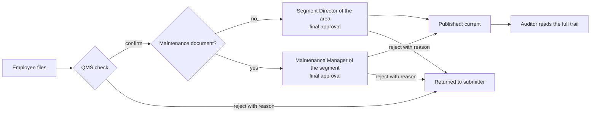
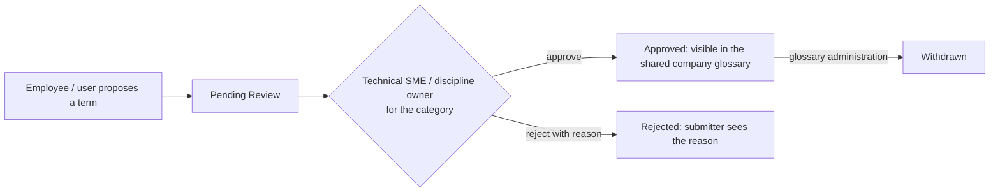

# TechHub business rules

The authoritative statement of how documents move through TechHub, for the team building the Azure back end. It describes the **current code** (`roles.js`, `store.js` and the pages that call them) including the owner's decisions of 1 October 2026 (`docs/QA/FIVE-ROLE-QA-AUDIT.md` §13). Section 12 lists every place where the code and the documentation disagree; nothing there was silently resolved. Sections 13 (Field Glossary) and 14 (Segment membership) are **target production requirements** set by the owner that the prototype does not implement.

> In the prototype every rule below runs in the browser and can be bypassed with the developer console. In production each one must be enforced by the API from the signed-in identity. See `AZURE-INTEGRATION-REQUIREMENTS.md` §4.

---

## 1. Personas

| Persona | Code key | Scope | In one sentence |
|---|---|---|---|
| Employee | `employee` | **target:** their operational segment(s) by membership, plus every Corporate Function, Center of Excellence and Company Wide, read (§14). *Prototype: every area* | Reads current documents, files new ones, sees what happened to their own submissions. |
| QMS / Document Controller | `qms` | every area | Checks every submitted document first, owns the register, withdrawal, periodic review and the F086 export. Never gives final approval. |
| Segment Director (also Function Head, Centre Manager, Corporate Sponsor, by area family) | `owner` | **one** area | Gives final approval to that area's **Operations** (non-maintenance) documents and manages them. |
| Maintenance Manager | `maintenance` | **one operational segment** | Gives final approval to that segment's **maintenance** documents and manages them. |
| External Auditor | `auditor` | every area, read | Reads everything, including drafts, withdrawn records and the register export. Changes nothing. |

The area a Director or Maintenance Manager holds belongs to the **person**, not the role: every area (25 in the register, including Company Wide) has its own holder. A Maintenance Manager can hold only an operational segment, because only operational segments have a maintenance department.

## 2. The two workflows

- **Operations:** Employee → QMS check → Segment Director → Published → Auditor.
- **Maintenance:** Employee → QMS check → Maintenance Manager → Published → Auditor.

Any role allowed to file (everyone except the Auditor) can start either workflow.

### Stages (`approvalStage`, only while `status = draft`)

| Stage | Meaning | Who acts | Moves to |
|---|---|---|---|
| `qms` | Filed, waiting on the QMS conformance check | QMS | `director` (confirm) or returned (reject) |
| `director` | Checked, waiting on final approval. The stage is named `director` for both workflows | the area's Segment Director, or for a maintenance document the segment's Maintenance Manager | `status = current` (approve) or returned (reject) |
| `null` | Released, returned, or never submitted | nobody | — |

A draft that shipped in the register without a stage is treated as `qms`. A returned draft (`rejected = true`) has no stage and sits in no queue.

## 3. What makes a document "Maintenance"

A document is a maintenance document if **either**:
1. `department = "maintenance"` (Upload's "Maintenance department document" box, ticked automatically when filing from a segment's Maintenance tab), **or**
2. `docType = "bulletin"` (Maintenance Bulletin), whatever the department field says.

(`TAQA_APPROVAL.isMaintenance`.) Everything else is an Operations document.

**Maintenance Bulletins exist only for operational segments** (owner's decision D8). Upload does not offer the type for a corporate function, centre or the company, and the register refuses one there: those areas have no Maintenance Manager, so a bulletin would have no valid final approver. Upload ticks and locks the maintenance box for a bulletin.

## 4. Authority, by persona

### QMS / Document Controller
- **Check** (stage `qms` → `director`): any document in any area. Records `countersignedBy/At`.
- **Reject** at the QMS stage, with a reason.
- **Withdraw** and **edit details** of any document in any area.
- **Never** gives final approval, including when acting under someone's delegation (delegations apply only to the role that holds them).
- Opens every desk, the Master List, Analytics and About; exports F086; bulk-confirms drafts at stage `qms` from the Master List (bulk confirm never publishes).

### Segment Director
- **Final approval** (stage `director` → `current`) only when **all** hold: the document's area is the Director's own area, and the document is **not** a maintenance document. Records `approvedBy/At`.
- **Reject** at the final stage under the same conditions.
- **Withdraw / edit details** of the area's **Operations** documents only.
- Opens their own area's desk and published list; refused on other areas' desks, the Master List, Analytics and About.

### Maintenance Manager
- **Final approval** only when the document's area is their own segment **and** it is a maintenance document.
- **Reject** at the final stage under the same conditions.
- **Withdraw / edit details** of the segment's **maintenance** documents only.
- Opens their own segment's desk (header "Maintenance Manager, ‹area›"; counters count maintenance documents only) and published list (maintenance documents only); refused elsewhere. Lands on the segment's Maintenance side.

### Employee
- Files documents. Reads current documents in the areas they can see: **target** their own operational segment(s) by membership plus every Corporate Function, Center of Excellence and Company Wide (§14); *the prototype shows every area*. Sees their own drafts' title and status ("Waiting on QMS check", "Returned by …: ‹reason›"); someone else's draft shows "Access restricted".
- No desk, no Master List, no Analytics or About, no withdraw, no edit.

### External Auditor
- Reads everything, including drafts, withdrawn records, every trail and the Master List; exports F086.
- **Cannot** file, check, approve, reject, withdraw, edit or delegate. The register refuses every write from this role.

## 5. Area restrictions
- A Director or Maintenance Manager acts only in the one area they hold. Another area's desk and published list refuse them; approval, rejection, withdrawal and edit refuse them.
- QMS and Auditor are not area-scoped (the Auditor only reads).
- **Target:** an Employee's reading is scoped by **segment membership** (§14): their own operational segment(s), every Corporate Function, every Center of Excellence and Company Wide, and no other operational segment. An employee with no membership sees no operational segment. *The prototype does not scope Employees.*
- **Target:** a Segment Director or Maintenance Manager reads the operational segment they hold, every Corporate Function, every Center of Excellence and Company Wide; holding a role gives **no** visibility of other operational segments (each needs an explicit membership, §14.2).
- **Target:** an Employee files only into areas they are authorised to see, enforced by the API (§14.3).
- Drafts: a scoped role sees drafts of its own area only.

## 6. Department restrictions (owner's decision, 1 Oct 2026)

| Withdraw / edit details | QMS | Segment Director (own area) | Maintenance Manager (own segment) | Another area's holder |
|---|---|---|---|---|
| Operations document | yes | **yes** | no | no |
| Maintenance document or bulletin | yes | no | **yes** | no |

Final approval follows exactly the same split.

## 7. Rejection and resubmission
- Rejection is allowed only to whoever may act at the current stage (QMS at `qms`, the right final approver at `director`).
- A reason is **required**. The store refuses an empty reason; the desk requires at least 20 characters.
- A rejected document keeps `status = draft`, gets `rejected = true`, `rejectedAtStage`, `rejectedBy/At/Date`, `rejectedReason`, and leaves both queues. It can never be checked or approved afterwards.
- The submitter sees "Returned by ‹role›: ‹reason›" in Upload's "Your submissions" and on the document page.
- **Resubmission is a new filing**: the revised document is filed again from Upload, receives a new record and number, and starts at stage `qms`. The returned record stays as history.

## 8. Withdrawal and revision
- Withdrawing sets `status = obsolete`. The record stays in the register and every reader sees "Withdrawn, do not use". Download, print, offline pin and the quick-reference card are disabled for withdrawn documents.
- Changing a published document's content is a **new controlled revision**: Upload, "Revision / Update", naming the document it replaces (`supersedes`). It goes through both release steps like any document. Approval history is never rewritten.
- *Gap:* approving a revision does **not** automatically mark the old revision `superseded` in the prototype; QMS withdraws it separately. The API should decide whether release of a revision supersedes its predecessor in the same transaction (§12).

## 9. Delegation
- Only roles that hold `delegate` can grant: the **Segment Director** and the **Maintenance Manager**.
- A delegation records: delegate name, grantor's role and name (for a Maintenance Manager, "Maintenance Manager, ‹area›"), area, optional document types, whether approval is included, start date, end date, reason.
- **Must expire**: an end date is required and the span may not exceed **90 days**. An expired or revoked delegation stops working on its own.
- **No escalation**: a delegation can only pass on authority the grantor holds; a delegate signs **in the grantor's department** (a Director's delegate can never approve maintenance documents, a Maintenance Manager's delegate nothing else) and only in the grantor's area, narrowed further to the listed document types if any.
- A delegate **cannot re-delegate**.
- The signature records the delegate: "‹delegate› (delegate for ‹grantor›)".
- Each desk lists and revokes only the delegations its own holder granted for that area.
- A delegation never creates or changes Segment Membership. A delegate outside the grantor's segment sees only the delegated queue and its documents, only while the delegation is valid (§14.10).
- Switching role or area drops any delegation being acted under. *(Prototype: "Act as this" stands in for the delegate signing in.)*

## 10. Lifecycle-field protection
These fields change **only** through filing, check, approval, rejection and withdrawal, never by editing a record's details: `status`, `approvalStage`, `approvedBy`, `approvedDate`, `approvedAt`, `countersignedBy`, `countersignedDate`, `countersignedAt`, `rejected`, `rejectedAtStage`, `rejectedBy`, `rejectedReason`, `rejectedDate`, `rejectedAt`, `submittedBy`, `submittedAt`. An edit that names any of them is refused, for every role including QMS.

## 11. Reading rules (visibility)
- Withdrawn documents stay **visible** with a "do not use" banner (an old printed QR code must land somewhere), but cannot be downloaded, printed or pinned.
- Classifications: Employee sees `internal`; Director and Maintenance Manager `internal` and `confidential`; QMS and Auditor all, including `restricted`. A policy is always `internal` (TQ-QHSE-S001 5.5).
- A document page shows "Current, OK to use" only for `current` documents.
- **Target:** visibility also follows segment membership (§14). A document in an operational segment the user cannot see is treated as not found.

## 12. Where the code and the documentation disagree

| # | Discrepancy | Code does | Documentation says | Status |
|---|---|---|---|---|
| 1 | Who gives final approval for non-SOP types | The **area holder** (Segment Director / Function Head / Corporate Sponsor) approves any non-maintenance document in their area, whatever its type | The register's type table names other approvers: Manual "Subject Matter Expert", Lesson "QHSE Manager", Alert "Corp Function VP / Director", Policy "CEO". Upload's confirmation now names these, but the desk that receives the document is the area holder's | **Open business decision** for the owner and QHSE before the API encodes it |
| 2 | Release of a revision | Does not mark the superseded revision | TQ-QHSE-S001 / API Q2 expect the old revision to be withdrawn when the new one is released | **Open** (§8) |
| 3 | Stage name | Final-approval stage is called `director` for both workflows | — | Naming only; the API may rename it (`final`) |
| 4 | Role descriptions | Fixed during the handover audit: the QMS and Director descriptions (shown on the Master List) said QMS countersigns after the Director | — | **Fixed** (wording only) |
| 5 | August 2026 documents (`AZURE-MIGRATION-RAFA.md`, `PLATFORM-FUNCTIONAL-SPEC.md`, `DT-HANDOVER-PLAN.md`) | Two-step release, five personas, department rules | Describe a Power Automate approval flow and "approvals change only the screen" | Marked **historical**; this document supersedes them for rules |
| 6 | Field Glossary contributions | Any user adds a term and it appears **immediately**, in this browser only, as a "Community" term. No review | Production requires a proposal → Pending Review → technical SME approval before a term is shared (§13) | **Target requirement set by the owner (1 Oct 2026)**; prototype behaviour is not the target |
| 7 | Segment Contributors / Add Contributor | The area desk (Director, Maintenance Manager, QMS) has "Segment Contributors" and "+ Add Contributor": free-text name and job title, a role of **Editor / Viewer / Owner**, demo names, kept for the browser session only. It grants nothing. Every Employee sees every area | Production uses **Segment Members / Add Member**: membership (segment + Operations or Maintenance department) only, resolved from Entra ID by email, no role choice; the Director manages Operations members, the Maintenance Manager Maintenance members, QMS all; Employees see only their own operational segment(s) plus Corporate Functions, Centers of Excellence and Company Wide (§14) | **Target requirement set by the owner (1 Oct 2026)**; the prototype UI was not renamed |

## 13. Field Glossary contributions (target production requirement)

Owner's clarification, 1 October 2026. **Not implemented in the prototype**, and the prototype's behaviour must not be read as the target.

**Prototype today:** Field Glossary's "Add term" form (abbreviation and full name required, definition and field optional) adds the term at once. It is stored in this browser only (`localStorage` `taqa_glossary_custom`), labelled "Community", with no review and nobody else sees it.

**Production (Azure):**

1. **Propose.** Any signed-in user may propose a new term: term or abbreviation, full name, definition, category, and a source or reference where there is one. A proposal is saved as `pending` and is **not** visible in the shared glossary. The submitter can see their own proposals and their status.
2. **Review.** The **relevant technical SME / discipline owner** for the term's category reviews it and validates the terminology and the definition. They **approve** or **reject**. A rejection records a reason, which the submitter sees.
3. **Publish.** Only an `approved` term appears in the shared company glossary, for everyone.
4. **SME mapping.** Which SME or discipline owner reviews which category (Drilling, Well Control, Production, Safety & HSE, Engineering, Logging & Reservoir, Commercial, Maintenance, Human Resources, Cybersecurity, Document Control, General) is **defined by the business / IT implementation**, not by this prototype.
5. **QMS / Glossary administration.** Has company-wide administrative capability over the glossary register:
   - identify and remove duplicates
   - correct a term's category
   - manage and withdraw entries (`withdrawn`)
   - oversee the glossary register

   QMS is **not** automatically the technical approver of every field definition. Technical approval belongs to the category's SME. If QMS also acts as an SME for a category (for example Document Control), that comes from the SME mapping, not from the QMS role.
6. **Server-side.** Every step (propose, approve, reject, recategorise, withdraw) is enforced by the API from the signed-in identity, recorded with the actor and server time, and written to the audit trail.

Recommended for the implementation to confirm with the owner: a submitter does not review their own proposal; a proposal that duplicates an approved term is flagged to the reviewer; a correction to an approved definition goes through the same review; the built-in terms that ship with the prototype are loaded as `approved` seed data (source "TechHub prototype seed"), with the owner deciding whether SMEs re-validate them.

Entity: `DATA-MODEL.md` (GlossaryTerm). Endpoints: `API-REQUIREMENTS.md` §7. Acceptance: `AZURE-UAT-CHECKLIST.md` §8.

## 14. Segment membership (target production requirement)

Owner's clarifications, 1 October 2026 (the second one, on departments and the Maintenance Manager, replaces the first where they differ). **Not implemented in the prototype.** For Azure, the concept is called **Segment Members** and **Add Member**, replacing the prototype's "Segment Contributors" and "Add Contributor". Membership is organisational belonging and access, not a content-contributor permission.

### 14.1 Membership has two dimensions; role is separate

A membership is **operational segment + department**:

1. **Operational segment**, for example Coiled Tubing.
2. **Department / team** within that segment: **Operations** or **Maintenance**.

Example:

| | |
|---|---|
| Employee | `Mohammed.jahdali@tq.com` |
| Segment | Coiled Tubing |
| Department | Maintenance |
| Role | Employee |

| | Membership | Role |
|---|---|---|
| Answers | Which operational segment and team does this employee belong to, and therefore see? | What authority does this person have? |
| Example | Mohammed Jahdali → Coiled Tubing, Maintenance | Mohammed Jahdali → Employee |
| Example | Ali Example → Coiled Tubing, Maintenance | Ali Example → Maintenance Manager |
| Comes from | An authoritative company source if one exists (§14.6), otherwise Add Member | Trusted Entra ID / server-side role mapping only (`AZURE-INTEGRATION-REQUIREMENTS.md` §3) |

Both people above belong to Coiled Tubing Maintenance; they have different authority. **Membership never grants a role:**
- Adding someone as Coiled Tubing + **Maintenance** does **not** make them Maintenance Manager.
- Adding someone as Coiled Tubing + **Operations** does **not** make them Segment Director.
- QMS / Document Controller, Segment Director, Maintenance Manager and External Auditor come only from trusted Entra / server-side role mapping and cannot be assigned from Add Member. "Owner" can never be assigned from it.

Department membership primarily determines **team administration** (who manages the member, §14.5) and any department-specific experience or routing (for example landing on the segment's Maintenance side). It does **not** itself grant approval authority.

### 14.2 What each person sees

| Person | Sees |
|---|---|
| Employee with a membership (either department) | Their member segment(s), both Operations and Maintenance sides; every Corporate Function; every Center of Excellence; Company Wide |
| Employee with **no** operational-segment membership | Every Corporate Function; every Center of Excellence; Company Wide. **No operational segment** until an explicit membership is added |
| Segment Director / Maintenance Manager | The operational segment they hold / manage; every Corporate Function; every Center of Excellence; Company Wide; plus any segment where they hold an explicit additional membership |
| QMS / authorised administration | Every area, as their role requires |
| External Auditor | Every area, as their role requires (read only) |

Holding a role (Segment Director, Maintenance Manager) does **not** automatically give visibility of other operational segments; any other segment needs an explicit additional membership (§14.8). Nobody sees an operational segment because of a URL, a link or a search result alone.

### 14.3 What a normal member can and cannot do
A segment member is still an **Employee**, whichever department. They can:
- view their assigned operational segment, the Corporate Functions, the Centers of Excellence and Company Wide
- submit / upload documents through the normal controlled workflow (QMS check, then final approval), **only into areas they are authorised to see** (§14.2)
- track their own submissions

They cannot:
- perform the QMS check, give final approval, or delegate approval authority
- manage segment membership
- reach or file into another operational segment by changing a URL, an area id, JavaScript, `localStorage` or an API payload; the API decides filing scope from stored membership
- assign roles to themselves or to anyone else

Because every Employee can already submit documents, the prototype's **"Editor = can upload documents" is redundant and is not carried into the Azure permission model**. There is no Editor, Viewer or Owner in membership. If the business later needs a special Editor capability, it must have a real, separately defined purpose beyond normal document upload. A read-only membership, if ever needed, is an **optional future exception**, not part of the normal Add Member process.

### 14.4 Add Member (production)
Add Member is **contextual**:
- from an Operations management context: **"Add Operations Member"**
- from a Maintenance management context: **"Add Maintenance Member"**

1. The person adding enters **only the corporate employee email**, for example `Mohammed.jahdali@tq.com`. No name, job title, initials or other free-text identity, **no Editor / Viewer / Owner choice**, and no segment or department field to edit.
2. The server queries Microsoft Entra ID / the company directory and resolves: the **immutable user / object id**, display name, corporate email, job title if available, and account status.
3. The person adding sees the resolved employee before confirming, for example:

   > **Mohammed Jahdali**
   > Mohammed.jahdali@tq.com
   > ‹Job title if available›
   >
   > [Add to Coiled Tubing Maintenance]

4. On confirmation the **server assigns the segment and department from the authorised manager's context** and stores the membership against the **immutable Entra identity**, not the email or display name alone. A disabled or unknown account is refused. Name, email and title are display data refreshed from the directory.
5. The manager **cannot change the request** to place someone outside their permitted segment or department; the API checks the target segment and department against the manager's own authority on every call.

Adding a member creates segment membership only. Removing a member removes that segment's visibility for them (unless another membership or source still grants it).

### 14.5 Who manages membership
| Persona | View members | Add / remove members |
|---|---|---|
| Segment Director | Own segment, both departments | **Operations** members of own segment only. Cannot add or remove Maintenance members |
| Maintenance Manager | Own segment, both departments | **Maintenance** members of own segment only. Cannot add or remove Operations members |
| QMS / authorised administration | All segments and departments | All segments and departments |
| Employee | No | **No.** Add Member is hidden completely |
| External Auditor | No | **No.** Hidden completely |

This mirrors the document rules: the Segment Director manages the segment's Operations side, the Maintenance Manager its Maintenance side (§6). A delegate does not gain membership management unless the owner later decides otherwise.

### 14.6 Automatic assignment (preferred, to be verified by IT)
IT should first investigate whether operational-segment **and department** membership can be **derived automatically** from an authoritative company source, for example Entra organisational attributes, the HR system, business unit, department, organisational unit, cost centre, or another authoritative employee attribute.

Preferred target: authoritative company data says the employee belongs to Coiled Tubing Maintenance → TechHub assigns that membership automatically. Add Member is then used only for exceptions, corrections, and cases where the authoritative source does not provide enough information.

**Do not assume such an attribute exists today.** IT must verify it. Each membership records its source (automatic or manual) so an automatic membership is not silently overwritten by a manual one, and vice versa.

### 14.7 Server enforcement
Membership is enforced by the Azure API, never by the browser. An employee assigned to Coiled Tubing must **not** obtain Drilling access by changing the URL, modifying JavaScript, editing `localStorage`, changing an area id in an API request, or calling the API directly. The API calculates the user's visible operational areas from the authenticated user's **stored membership**; Corporate Functions, Centers of Excellence and Company Wide remain visible as in §14.2. Lists, search, document pages, attachments, notifications and the submit endpoint all apply the same rule. Membership management checks the manager's segment **and** department on every add and remove.

### 14.8 Primary and additional segment membership
- The normal model is **one primary operational segment** per employee (from the authoritative source where available, otherwise Add Member).
- An **additional** segment membership is allowed **only as an approved exception**. Each one records:
  - the employee's immutable Entra id
  - segment
  - department
  - who assigned it
  - assigned date and time (server)
  - **reason** (required)
  - optional **expiry date** where the assignment is temporary; at expiry it ends automatically and its visibility stops
- The **receiving department authority** manages it: the Segment Director for an Operations membership, the Maintenance Manager for a Maintenance membership (each in their own segment), QMS / authorised administration company-wide. Recording it with a reason is the approval.
- An additional membership **only expands visibility and filing scope**. It does **not** grant Segment Director, Maintenance Manager, QMS or any other authority.

### 14.9 One department per person per segment; transfers
- Normally an employee has **exactly one** department membership within a segment: Operations **or** Maintenance. Both are never created by default; a second, different-department membership in the same segment is refused.
- A move between Operations and Maintenance affects two departmental authorities, so it is an **audited transfer**:
  - **QMS / authorised administration performs** the transfer.
  - The relevant Operations or Maintenance manager (Segment Director or Maintenance Manager of that segment) may **request or confirm** it, according to the final business process.
  - **Both** the old and the new department managers are **notified**.
  - The old membership is closed as *transferred* and **stays in history**; the new membership is **linked** to it.
  - The record keeps **who performed** the transfer, **when**, and the **reason** (and who requested or confirmed it, if anyone).
- A department manager can **never** silently move an employee out of another department: a Director cannot transfer a Maintenance member and a Maintenance Manager cannot transfer an Operations member; their own add / remove rights (§14.5) do not include transfers.
- A change of primary segment follows the same transfer rule.

  Example: Mohammed Jahdali, Coiled Tubing / Operations → transferred to Coiled Tubing / Maintenance; requested by the Maintenance Manager of Coiled Tubing; performed by QMS on ‹date and time›; reason ‹…›; Segment Director and Maintenance Manager of Coiled Tubing notified.
- Not built in the prototype.

### 14.10 Delegation outside the grantor's segment
A valid delegation (§9) may temporarily let a delegate work on documents outside their normal segment membership.
- It **does not create or change any Segment Membership.**
- The delegate gets only the **minimum access** the delegated work needs: the documents / queue the delegation covers (the grantor's area, department and listed document types), the actions the delegation allows, and only during its validity period.
- It does **not** expose the whole operational segment when the work can be scoped more narrowly: the delegate sees the delegated queue and the documents in it, not the segment's library.
- When the delegation expires or is revoked, the temporary access **ends automatically**.
- The server enforces all of this; nothing the browser sends can widen it.

### 14.11 Decisions
**There are no remaining Segment Membership business decisions** (owner, 1–2 October 2026):
1. Maintenance Manager manages Maintenance members of their own segment (§14.5).
2. Company Wide is visible to everyone (§14.2).
3. No membership: Corporate Functions, Centers of Excellence and Company Wide only (§14.2).
4. Directors and Maintenance Managers: their held segment plus Corporate Functions, Centers of Excellence and Company Wide; other segments only by explicit membership (§14.2).
5. Filing only into areas the person is authorised to see, server enforced (§14.3).
6. One primary segment; additional memberships as approved exceptions with reason and optional expiry (§14.8).
7. One department per person per segment; department changes are audited transfers performed by QMS / authorised administration, requested or confirmed by the department manager, both managers notified (§14.9).
8. A delegate outside the grantor's segment gets only the delegated queue, actions and period, with no membership (§14.10).

What remains for IT is implementation: for example how a manager's transfer request or confirmation is captured (a request record, a ticket or an approval step), which is part of the "final business process" and does not change these rules.
