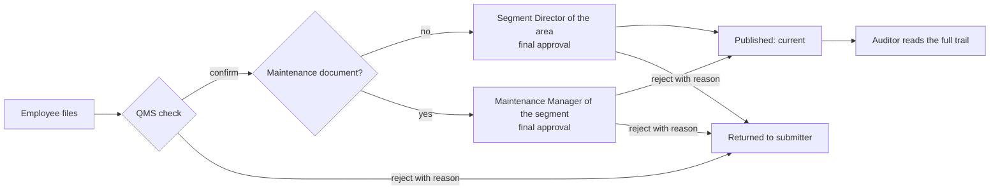

# TechHub business rules

The authoritative statement of how documents move through TechHub, for the team building the Azure back end. It describes the **current code** (`roles.js`, `store.js` and the pages that call them) including the owner's decisions of 1 October 2026 (`docs/QA/FIVE-ROLE-QA-AUDIT.md` §13). Section 12 lists every place where the code and the documentation disagree; nothing there was silently resolved.

> In the prototype every rule below runs in the browser and can be bypassed with the developer console. In production each one must be enforced by the API from the signed-in identity. See `AZURE-INTEGRATION-REQUIREMENTS.md` §4.

---

## 1. Personas

| Persona | Code key | Scope | In one sentence |
|---|---|---|---|
| Employee | `employee` | every area, read | Reads current documents, files new ones, sees what happened to their own submissions. |
| QMS / Document Controller | `qms` | every area | Checks every submitted document first, owns the register, withdrawal, periodic review and the F086 export. Never gives final approval. |
| Segment Director (also Function Head, Centre Manager, Corporate Sponsor, by area family) | `owner` | **one** area | Gives final approval to that area's **Operations** (non-maintenance) documents and manages them. |
| Maintenance Manager | `maintenance` | **one operational segment** | Gives final approval to that segment's **maintenance** documents and manages them. |
| External Auditor | `auditor` | every area, read | Reads everything, including drafts, withdrawn records and the register export. Changes nothing. |

The area a Director or Maintenance Manager holds belongs to the **person**, not the role: every area (25 in the register, including Company Wide) has its own holder. A Maintenance Manager can hold only an operational segment, because only operational segments have a maintenance department.

## 2. The two workflows

- **Operations:** Employee → QMS check → Segment Director → Published → Auditor.
- **Maintenance:** Employee → QMS check → Maintenance Manager → Published → Auditor.

Any role allowed to file (everyone except the Auditor) can start either workflow.

### Stages (`approvalStage`, only while `status = draft`)

| Stage | Meaning | Who acts | Moves to |
|---|---|---|---|
| `qms` | Filed, waiting on the QMS conformance check | QMS | `director` (confirm) or returned (reject) |
| `director` | Checked, waiting on final approval. The stage is named `director` for both workflows | the area's Segment Director, or for a maintenance document the segment's Maintenance Manager | `status = current` (approve) or returned (reject) |
| `null` | Released, returned, or never submitted | nobody | — |

A draft that shipped in the register without a stage is treated as `qms`. A returned draft (`rejected = true`) has no stage and sits in no queue.

## 3. What makes a document "Maintenance"

A document is a maintenance document if **either**:
1. `department = "maintenance"` (Upload's "Maintenance department document" box, ticked automatically when filing from a segment's Maintenance tab), **or**
2. `docType = "bulletin"` (Maintenance Bulletin), whatever the department field says.

(`TAQA_APPROVAL.isMaintenance`.) Everything else is an Operations document.

**Maintenance Bulletins exist only for operational segments** (owner's decision D8). Upload does not offer the type for a corporate function, centre or the company, and the register refuses one there: those areas have no Maintenance Manager, so a bulletin would have no valid final approver. Upload ticks and locks the maintenance box for a bulletin.

## 4. Authority, by persona

### QMS / Document Controller
- **Check** (stage `qms` → `director`): any document in any area. Records `countersignedBy/At`.
- **Reject** at the QMS stage, with a reason.
- **Withdraw** and **edit details** of any document in any area.
- **Never** gives final approval, including when acting under someone's delegation (delegations apply only to the role that holds them).
- Opens every desk, the Master List, Analytics and About; exports F086; bulk-confirms drafts at stage `qms` from the Master List (bulk confirm never publishes).

### Segment Director
- **Final approval** (stage `director` → `current`) only when **all** hold: the document's area is the Director's own area, and the document is **not** a maintenance document. Records `approvedBy/At`.
- **Reject** at the final stage under the same conditions.
- **Withdraw / edit details** of the area's **Operations** documents only.
- Opens their own area's desk and published list; refused on other areas' desks, the Master List, Analytics and About.

### Maintenance Manager
- **Final approval** only when the document's area is their own segment **and** it is a maintenance document.
- **Reject** at the final stage under the same conditions.
- **Withdraw / edit details** of the segment's **maintenance** documents only.
- Opens their own segment's desk (header "Maintenance Manager, ‹area›"; counters count maintenance documents only) and published list (maintenance documents only); refused elsewhere. Lands on the segment's Maintenance side.

### Employee
- Files documents. Reads current documents everywhere. Sees their own drafts' title and status ("Waiting on QMS check", "Returned by …: ‹reason›"); someone else's draft shows "Access restricted".
- No desk, no Master List, no Analytics or About, no withdraw, no edit.

### External Auditor
- Reads everything, including drafts, withdrawn records, every trail and the Master List; exports F086.
- **Cannot** file, check, approve, reject, withdraw, edit or delegate. The register refuses every write from this role.

## 5. Area restrictions
- A Director or Maintenance Manager acts only in the one area they hold. Another area's desk and published list refuse them; approval, rejection, withdrawal and edit refuse them.
- QMS, Employee and Auditor are not area-scoped (Employee and Auditor only read).
- Drafts: a scoped role sees drafts of its own area only.

## 6. Department restrictions (owner's decision, 1 Oct 2026)

| Withdraw / edit details | QMS | Segment Director (own area) | Maintenance Manager (own segment) | Another area's holder |
|---|---|---|---|---|
| Operations document | yes | **yes** | no | no |
| Maintenance document or bulletin | yes | no | **yes** | no |

Final approval follows exactly the same split.

## 7. Rejection and resubmission
- Rejection is allowed only to whoever may act at the current stage (QMS at `qms`, the right final approver at `director`).
- A reason is **required**. The store refuses an empty reason; the desk requires at least 20 characters.
- A rejected document keeps `status = draft`, gets `rejected = true`, `rejectedAtStage`, `rejectedBy/At/Date`, `rejectedReason`, and leaves both queues. It can never be checked or approved afterwards.
- The submitter sees "Returned by ‹role›: ‹reason›" in Upload's "Your submissions" and on the document page.
- **Resubmission is a new filing**: the revised document is filed again from Upload, receives a new record and number, and starts at stage `qms`. The returned record stays as history.

## 8. Withdrawal and revision
- Withdrawing sets `status = obsolete`. The record stays in the register and every reader sees "Withdrawn, do not use". Download, print, offline pin and the quick-reference card are disabled for withdrawn documents.
- Changing a published document's content is a **new controlled revision**: Upload, "Revision / Update", naming the document it replaces (`supersedes`). It goes through both release steps like any document. Approval history is never rewritten.
- *Gap:* approving a revision does **not** automatically mark the old revision `superseded` in the prototype; QMS withdraws it separately. The API should decide whether release of a revision supersedes its predecessor in the same transaction (§12).

## 9. Delegation
- Only roles that hold `delegate` can grant: the **Segment Director** and the **Maintenance Manager**.
- A delegation records: delegate name, grantor's role and name (for a Maintenance Manager, "Maintenance Manager, ‹area›"), area, optional document types, whether approval is included, start date, end date, reason.
- **Must expire**: an end date is required and the span may not exceed **90 days**. An expired or revoked delegation stops working on its own.
- **No escalation**: a delegation can only pass on authority the grantor holds; a delegate signs **in the grantor's department** (a Director's delegate can never approve maintenance documents, a Maintenance Manager's delegate nothing else) and only in the grantor's area, narrowed further to the listed document types if any.
- A delegate **cannot re-delegate**.
- The signature records the delegate: "‹delegate› (delegate for ‹grantor›)".
- Each desk lists and revokes only the delegations its own holder granted for that area.
- Switching role or area drops any delegation being acted under. *(Prototype: "Act as this" stands in for the delegate signing in.)*

## 10. Lifecycle-field protection
These fields change **only** through filing, check, approval, rejection and withdrawal, never by editing a record's details: `status`, `approvalStage`, `approvedBy`, `approvedDate`, `approvedAt`, `countersignedBy`, `countersignedDate`, `countersignedAt`, `rejected`, `rejectedAtStage`, `rejectedBy`, `rejectedReason`, `rejectedDate`, `rejectedAt`, `submittedBy`, `submittedAt`. An edit that names any of them is refused, for every role including QMS.

## 11. Reading rules (visibility)
- Withdrawn documents stay **visible** with a "do not use" banner (an old printed QR code must land somewhere), but cannot be downloaded, printed or pinned.
- Classifications: Employee sees `internal`; Director and Maintenance Manager `internal` and `confidential`; QMS and Auditor all, including `restricted`. A policy is always `internal` (TQ-QHSE-S001 5.5).
- A document page shows "Current, OK to use" only for `current` documents.

## 12. Where the code and the documentation disagree

| # | Discrepancy | Code does | Documentation says | Status |
|---|---|---|---|---|
| 1 | Who gives final approval for non-SOP types | The **area holder** (Segment Director / Function Head / Corporate Sponsor) approves any non-maintenance document in their area, whatever its type | The register's type table names other approvers: Manual "Subject Matter Expert", Lesson "QHSE Manager", Alert "Corp Function VP / Director", Policy "CEO". Upload's confirmation now names these, but the desk that receives the document is the area holder's | **Open business decision** for the owner and QHSE before the API encodes it |
| 2 | Release of a revision | Does not mark the superseded revision | TQ-QHSE-S001 / API Q2 expect the old revision to be withdrawn when the new one is released | **Open** (§8) |
| 3 | Stage name | Final-approval stage is called `director` for both workflows | — | Naming only; the API may rename it (`final`) |
| 4 | Role descriptions | Fixed during the handover audit: the QMS and Director descriptions (shown on the Master List) said QMS countersigns after the Director | — | **Fixed** (wording only) |
| 5 | August 2026 documents (`AZURE-MIGRATION-RAFA.md`, `PLATFORM-FUNCTIONAL-SPEC.md`, `DT-HANDOVER-PLAN.md`) | Two-step release, five personas, department rules | Describe a Power Automate approval flow and "approvals change only the screen" | Marked **historical**; this document supersedes them for rules |
