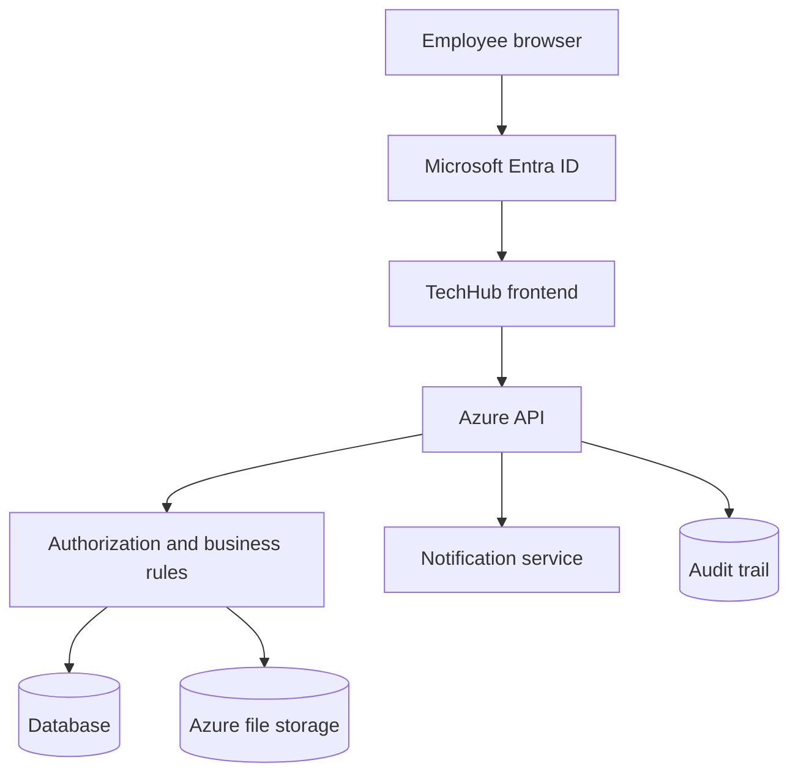

# TechHub: handover to IT

**Start here.** This is the entry point for the TAQA IT team taking over TechHub (the TAQA Knowledge Hub) for Azure integration. It is short on purpose and points to the detailed documents.

| | |
|---|---|
| Product owner | Mohammed Al-Jahdali, TAQA Learning Center |
| Repository branch at handover | `claude/inspiring-mayer-pm1350`, PR #21 (merge to `main` is the owner's decision) |
| Status | **Frontend prototype, ready for integration.** Not production. No back end, no sign-in, no real storage |
| Audit date | 1 October 2026 |

---

## 1. What TechHub is
An internal web portal where TAQA field and office staff find controlled documents (procedures, standards, manuals, forms, maintenance bulletins, alerts, lessons learned) for every operational segment, corporate function and centre; check that a revision is current before using it; ask a segment expert; and look up field terminology.

It also contains the document-control workflow that will release those documents:

- **Operations:** Employee files → **QMS** checks → **Segment Director** approves → published → **Auditor** reviews.
- **Maintenance:** Employee files → **QMS** checks → **Maintenance Manager** approves → published → **Auditor** reviews.

Five personas: Employee, QMS / Document Controller, Segment Director, Maintenance Manager, External Auditor. Rules: **`BUSINESS-RULES.md`**.

## 2. Run it

```
git clone <repository-url> techhub && cd techhub
npm ci
npm run serve                 # http://127.0.0.1:4173
```

Any static web server works (`npm run serve:python` uses Python's). There is **no build step**: the pages, scripts, styles, fonts, icons and images are the deployable artefact. Use the "View as" control in the top bar (the ☰ menu on a phone) to switch persona and area. That control is a **preview stand-in for Entra ID** and must not ship.

## 3. Test it

```
npx playwright install --with-deps chromium
npm test                      # chromium desktop + mobile-chrome, ~906 tests, ~18 min (use --workers=2 on small machines)
```

Details, engines and conventions: **`TESTING.md`**. Latest results: §8 below.

## 4. What is already implemented (frontend, working in the prototype)
- Area libraries for every segment, function and centre; Operations | Maintenance sides for operational segments; document page with status, revision, approval trail, QR code, print and quick-reference card; withdrawn documents stay visible as "do not use".
- Search, Master List with F086 export, filters and bulk QMS confirm, Field Glossary, Ask Expert form, Upload with TQ-QHSE-S001 numbering, file-type and size checks and a "Your submissions" list.
- The full two-step release workflow for both departments, rejection with reasons, resubmission, withdrawal, delegation with expiry, five-role permissions, department and area scoping, lifecycle-field protection, notification bell, PWA with offline reading.
- Responsive desktop and phone layouts, dark theme, keyboard support.

## 5. What is prototype-only (must be replaced)
Everything below lives in the browser today. A user with the developer console can bypass every rule. **None of it is security.**

| Prototype | Replace with |
|---|---|
| Role and area chosen in a switcher (`localStorage`) | Microsoft Entra ID sign-in and server-side group/role mapping |
| Rules in `roles.js` / `store.js` | The same rules enforced by the Azure API (`API-REQUIREMENTS.md`) |
| Register in `documents-master.js` + `localStorage` | Database behind the API (`DATA-MODEL.md`) |
| Signers as role labels, browser timestamps | User identity from the token, server time |
| No file storage ("Preview not connected") | Azure file storage with scanning and authorized download |
| Notification bell computed in the browser | Notification service |
| Trail reconstructed in the page | Append-only audit trail |
| Demo names and activity, "Act as this" delegation button, `TAQA_STORE.reset()` | Real data / removal |
| Field Glossary "Add term": published at once as a "Community" term, this browser only, no review | Proposal → Pending Review → category SME approves or rejects → shared glossary; QMS administers the register (`BUSINESS-RULES.md` §13) |

Full list with classifications (UI only / business rule / data / security): **`AZURE-INTEGRATION-REQUIREMENTS.md` §4 and §9**.

## 6. What Azure must provide
Identity (Entra ID), the TechHub API with authorization and business rules, a database, private file storage, notifications, an audit trail, per-environment configuration, hosting and CI/CD. Requirements, configuration strategy, Entra mapping, concurrency, files, hosting/routing, PWA and error handling: **`AZURE-INTEGRATION-REQUIREMENTS.md`**. Endpoints: **`API-REQUIREMENTS.md`**.



## 7. Business rules that must survive the migration
Two-step release in that order (QMS first, then the final approver). Department split for final approval **and** for withdraw/edit: Operations documents to the area's Segment Director, maintenance documents (department `maintenance` or type Maintenance Bulletin) to the segment's Maintenance Manager; QMS manages every document but never approves. Area scoping. Maintenance Bulletins only for operational segments. Rejection needs a reason; resubmission is a new filing. Delegation expires (at most 90 days), never escalates, never re-delegates, stays in the grantor's department and area. Lifecycle and signature fields never change by editing. The Auditor changes nothing. Field Glossary terms are proposed, reviewed by the category's technical SME and only then shared; QMS administers the glossary register but is not automatically its technical approver (`BUSINESS-RULES.md` §13; not built in the prototype). **`BUSINESS-RULES.md`**, including §12, where the code and older documents disagree.

## 8. State at handover (measured 1 October 2026)

| Area | Result |
|---|---|
| Fresh checkout | Clone, `npm ci` (empty cache), serve, Playwright install and tests all work using only the repository and public registries |
| Secrets | **None found.** No keys, tokens, passwords, connection strings or certificates in tracked files. The only email is the product owner's work address in document contact lines |
| Automated tests | Full suite (`npm test`, 906 tests): chromium desktop **451 passed, 1 failed, 1 skipped**; mobile-chrome **452 passed, 0 failed, 1 skipped**; 18.9 min. The one failure was a **flaky test** (the dialog's delayed autofocus raced the test's typing), fixed in the test and re-run green (dashboard spec 34/34). The skip is the environment-guarded offline test |
| Engines | Chromium desktop and mobile: full suite. Firefox and WebKit: both workflows pass when driven directly; the test fixtures are Chromium-only (`TESTING.md`) |
| Direct URLs / refresh | 38 of 38 page loads correct at desktop and phone width |
| Service worker | A new deployment reaches online users on their next reload; old caches are deleted |
| Dependencies | No runtime dependencies; `npm audit` 0 vulnerabilities |
| Accessibility smoke | No unnamed controls or missing alt text on key pages; three search fields still rely on placeholder text as their label |

## 9. Known limitations and open decisions
- **Not production security** until the API enforces the rules.
- Open business decisions (owner and QHSE): who gives final approval for non-SOP types whose register approver is someone other than the area holder (`BUSINESS-RULES.md` §12 #1); whether releasing a revision supersedes the old one automatically (§12 #2); whether Ask Expert requests and analytics become shared server-side data (glossary contributions are **decided**: SME-reviewed, shared, `BUSINESS-RULES.md` §13; the category-to-SME mapping is for the business and IT to define); whether a person can hold several roles at once.
- Open technical decisions (IT): API hosting (Functions, App Service, Container Apps), database, notification channel, built-in platform auth or MSAL, keeping GitHub Pages, packaging only app files for deployment, a proper 404 page.
- Prototype data: `documents-master.js` holds 585 register entries reconstructed for the prototype; validate against SCORE / QHSE before any migration.
- The BW Gradual font is commercial: confirm the web licence.

## 10. Recommended first steps for IT
1. Read `BUSINESS-RULES.md`, then run the prototype through both journeys with "View as".
2. Create the Entra app registration(s) and the group/app-role mapping for the five personas and their areas (`AZURE-INTEGRATION-REQUIREMENTS.md` §3).
3. Stand up DEV hosting under TAQA's tenant with the configuration pattern in §2 and CSP moved to headers.
4. Build the API from `API-REQUIREMENTS.md`, rules first (approve, confirm, reject, withdraw, delegation) with optimistic concurrency, plus `GET /me`.
5. Replace `store.js` / `roles.js` internals with API calls, keeping their function names so the pages change least; remove the role switcher.
6. Add file storage, notifications and the audit trail, then the Field Glossary proposal and SME review workflow (`API-REQUIREMENTS.md` §7).
7. Run `AZURE-UAT-CHECKLIST.md` with real accounts.

## 11. Document map

| Document | Purpose |
|---|---|
| `HANDOVER-TO-IT.md` | This entry point |
| `BUSINESS-RULES.md` | The authoritative rules, code/document discrepancies, and the target Field Glossary workflow (§13) |
| `AZURE-INTEGRATION-REQUIREMENTS.md` | Architecture, configuration, Entra, frontend/backend boundary, files, notifications, hosting, PWA, error states, baselines |
| `API-REQUIREMENTS.md` | Proposed API contract |
| `DATA-MODEL.md` | Prototype objects, Azure entities, server-owned fields, concurrency |
| `AZURE-UAT-CHECKLIST.md` | Acceptance checklist to run **after** integration |
| `TESTING.md` | How to install, run and extend the tests |
| `QA/FIVE-ROLE-QA-AUDIT.md` | The five-role audit and the owner's decisions (current evidence) |
| `QA/QA-RELEASE-REPORT.md`, `QA/RELEASE-QA-E2E.md` | Earlier QA (history; four-role parts marked stale) |
| `qa-evidence/` | Scripts, raw results and screenshots behind the audits |
| `FRONTEND-API-CONTRACT.md` | Map from each prototype JavaScript function to its future endpoint |
| `HUB-DOCUMENT-CONTROL-SPEC.md`, `QHSE-S001-GAP-ANALYSIS.md` | Background on TQ-QHSE-S001, ISO 9001 and API Q2 alignment |
| `AZURE-MIGRATION-RAFA.md`, `DT-HANDOVER-PLAN.md`, `PLATFORM-FUNCTIONAL-SPEC.md`, `SECURE-SDLC-ASSESSMENT.md`, `CYBERSECURITY-REVIEW-PACK.md`, `PLAIN-ENGLISH-GUIDE.md`, `pdf/` | **Historical** (August 2026). Background on the original migration plan and reviews; they predate the current workflow and are superseded where they differ |
| `../config/techhub.config.example.js` | Per-environment configuration template (placeholders only) |
